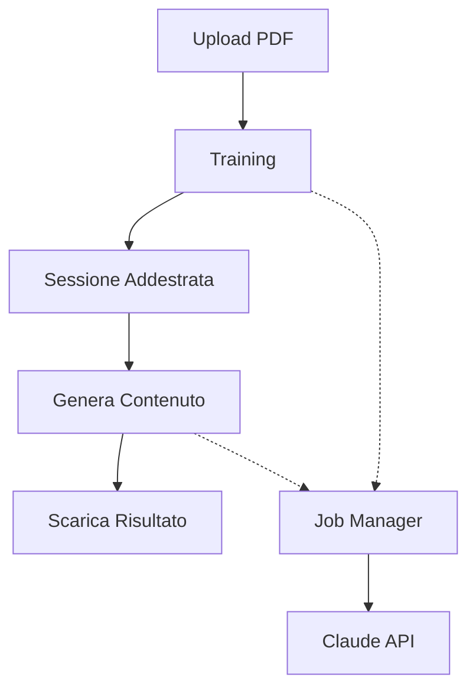

# StyleForge

Sistema completo per la generazione di contenuti utilizzando Claude Opus 4.5 con interfaccia web moderna.

## Panoramica

StyleForge è un'applicazione full-stack che permette di:
1. **Addestrare** Claude su documenti PDF per apprendere uno stile di scrittura
2. **Generare** contenuti basati sullo stile appreso
3. **Gestire** multiple sessioni indipendenti
4. **Monitorare** job in tempo reale con interfaccia moderna

## Architettura

```
StyleForge/
├── backend/          # FastAPI + Claude API
│   ├── api.py       # Server REST
│   ├── models.py    # Modelli Pydantic
│   ├── session_manager.py  # Gestione sessioni
│   └── job_manager.py      # Gestione job asincroni
│
└── frontend/        # React + Vite
    ├── src/
    │   ├── pages/   # Login, Dashboard, Train, Generate
    │   ├── components/  # Componenti UI
    │   └── services/    # API client
    └── ...
```

## Quick Start

### 1. Backend Setup

```bash
cd backend

# Crea virtual environment
python3 -m venv venv
source venv/bin/activate

# Installa dipendenze
pip install -r requirements.txt

# Configura
cp .env.example .env
# Modifica .env e aggiungi ANTHROPIC_API_KEY

# Avvia server
python api.py
```

Backend disponibile su: **http://localhost:8000**
Documentazione API: **http://localhost:8000/docs**

### 2. Frontend Setup

```bash
cd frontend

# Installa dipendenze
npm install

# Configura
cp .env.example .env
# Modifica .env e imposta VITE_ACCESS_CODE

# Avvia dev server
npm run dev
```

Frontend disponibile su: **http://localhost:5173**

## Utilizzo

### 1. Login

Accedi con il codice configurato in `frontend/.env`:
- Codice predefinito: `styleforge2025`

### 2. Training

1. Vai su "Nuovo Training"
2. Carica un file PDF (es. un libro, articoli, saggi)
3. Configura il numero di pagine da analizzare
4. Avvia il training e attendi il completamento

### 3. Generazione

1. Seleziona una sessione addestrata
2. Inserisci l'argomento desiderato
3. Specifica il numero di parole
4. Genera e scarica il contenuto

## Caratteristiche

### Backend

- ✅ API RESTful con FastAPI
- ✅ Gestione sessioni multiple isolate
- ✅ Sistema di job queue con concorrenza configurabile
- ✅ Background processing asincrono
- ✅ Cleanup automatico risorse
- ✅ Health monitoring
- ✅ Docker support

### Frontend

- ✅ Autenticazione con codice segreto
- ✅ Design moderno con Tailwind CSS
- ✅ Dashboard real-time
- ✅ Upload PDF con preview
- ✅ Monitoraggio job live
- ✅ Download risultati
- ✅ Responsive design

## Documentazione

- **Backend API**: `backend/README_API.md`
- **Frontend**: `frontend/README.md`
- **Architettura**: `backend/ARCHITECTURE.md`
- **Quick Start Backend**: `backend/QUICKSTART.md`

## Configurazione

### Backend (`.env`)

```env
ANTHROPIC_API_KEY=sk-ant-api03-...
MAX_TOKENS_TRAIN=4096
MAX_TOKENS_TEST=8192
MAX_CONCURRENT_JOBS=10
```

### Frontend (`.env`)

```env
VITE_API_URL=http://localhost:8000
VITE_ACCESS_CODE=tuo-codice-segreto
```

## Deploy

### Backend

```bash
# Docker
cd backend
docker-compose up -d

# O manuale
uvicorn api:app --workers 4 --host 0.0.0.0 --port 8000
```

### Frontend

```bash
cd frontend
npm run build
# Deploy cartella dist/ su Vercel, Netlify, etc.
```

## Tecnologie

### Backend
- FastAPI
- Python 3.11+
- Anthropic Claude API
- asyncio
- PyMuPDF

### Frontend
- React 18
- Vite
- Tailwind CSS
- React Router
- Axios
- Lucide Icons

## Workflow Completo



## Esempi d'Uso

### API (cURL)

```bash
# Crea sessione
curl -X POST http://localhost:8000/sessions

# Training
curl -X POST http://localhost:8000/train \
  -F "file=@documento.pdf" \
  -F "session_id=session_abc" \
  -F "max_pages=50"

# Genera contenuto
curl -X POST http://localhost:8000/generate \
  -H "Content-Type: application/json" \
  -d '{
    "session_id": "session_abc",
    "argomento": "Psicologia",
    "numero_parole": 1000
  }'
```

### Python Client

```python
from backend.services.api import createSession, trainSession, generateContent

# Crea sessione
session = createSession()

# Training
job = trainSession("documento.pdf", session["session_id"])

# Genera
content = generateContent(
    session["session_id"],
    "Intelligenza emotiva",
    1000
)
```

## Sicurezza

⚠️ **Importante**:

1. **Cambia il codice di accesso** in `frontend/.env`
2. **Non committare** file `.env`
3. **Usa HTTPS** in produzione
4. **Limita accesso API** con rate limiting
5. **Monitora utilizzo** API Claude

## Performance

- **Sessioni concorrenti**: Illimitate
- **Job concorrenti**: 10 (configurabile)
- **Timeout training**: ~5-10 min (dipende da PDF)
- **Timeout generazione**: ~1-3 min

## Troubleshooting

### Backend non si avvia

```bash
# Verifica API key
echo $ANTHROPIC_API_KEY

# Verifica dipendenze
pip list

# Controlla logs
python api.py
```

### Frontend non si connette

```bash
# Verifica backend sia attivo
curl http://localhost:8000/health

# Controlla VITE_API_URL in .env
cat frontend/.env
```

### Job rimane in pending

```bash
# Aumenta concorrenza in backend/.env
MAX_CONCURRENT_JOBS=20

# Verifica Claude API limits
# Controlla logs backend
```

## Roadmap

- [ ] WebSocket per aggiornamenti real-time
- [ ] AI Detection integrato nel frontend
- [ ] Sistema di cache risultati
- [ ] Multi-utente con autenticazione JWT
- [ ] Dashboard analytics
- [ ] Export in formati multipli (PDF, DOCX)

## Contributi

Contributi benvenuti! Per favore:
1. Fork il repository
2. Crea un branch per la feature
3. Commit le modifiche
4. Push e apri una Pull Request

## Licenza

MIT

## Supporto

- **Issues**: GitHub Issues
- **Docs**: `/backend/README_API.md` e `/frontend/README.md`
- **API Docs**: http://localhost:8000/docs

---

Made with ❤️ using Claude Opus 4.5
