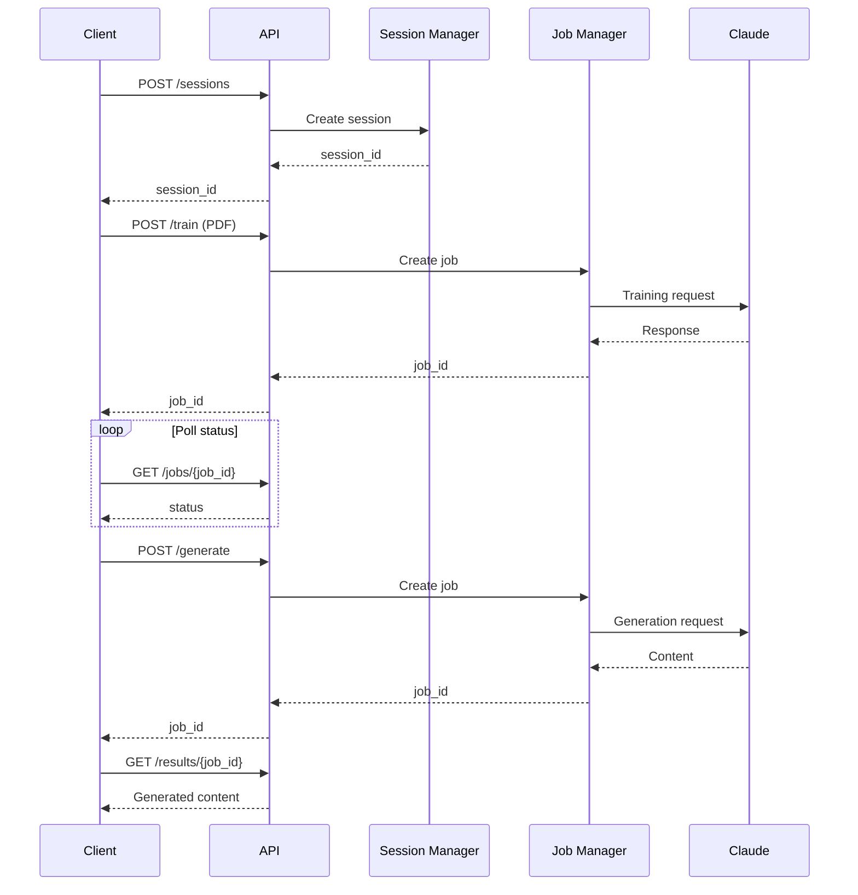

# Quick Start - StyleForge API

Guida rapida per iniziare con StyleForge API in 5 minuti.

## 1. Setup Iniziale

```bash
# Clona o naviga nella directory backend
cd backend

# Copia configurazione esempio
cp .env.example .env

# Modifica .env e aggiungi la tua API key
# ANTHROPIC_API_KEY=sk-ant-api03-...
nano .env
```

## 2. Installazione Dipendenze

### Opzione A: Con script (consigliato)

```bash
chmod +x run.sh
./run.sh dev
```

### Opzione B: Manuale

```bash
# Crea virtual environment
python3 -m venv venv
source venv/bin/activate  # Linux/Mac
# venv\Scripts\activate  # Windows

# Installa dipendenze
pip install -r requirements.txt

# Crea directories
mkdir -p uploads results

# Avvia server
uvicorn api:app --reload
```

### Opzione C: Docker

```bash
docker-compose up -d
```

## 3. Verifica Installazione

```bash
# Health check
curl http://localhost:8000/health

# Apri documentazione interattiva
open http://localhost:8000/docs
```

## 4. Primo Utilizzo

### Via cURL

```bash
# 1. Crea sessione
SESSION_ID=$(curl -X POST "http://localhost:8000/sessions" | jq -r '.session_id')
echo "Session: $SESSION_ID"

# 2. Addestra con PDF
TRAIN_JOB=$(curl -X POST "http://localhost:8000/train" \
  -F "file=@documento.pdf" \
  -F "session_id=$SESSION_ID" \
  -F "max_pages=50" | jq -r '.job_id')
echo "Training Job: $TRAIN_JOB"

# 3. Monitora training
curl "http://localhost:8000/jobs/$TRAIN_JOB"

# 4. Genera contenuto (quando training completato)
GEN_JOB=$(curl -X POST "http://localhost:8000/generate" \
  -H "Content-Type: application/json" \
  -d "{
    \"session_id\": \"$SESSION_ID\",
    \"argomento\": \"Psicopatologia\",
    \"numero_parole\": 1000
  }" | jq -r '.job_id')
echo "Generation Job: $GEN_JOB"

# 5. Scarica risultato
curl "http://localhost:8000/results/$GEN_JOB" -o risultato.txt
```

### Via Python

```bash
# Usa il client di esempio
python example_client.py
```

## 5. Architettura Visuale

```
Client Request
      ↓
   FastAPI
      ↓
  ┌──────────┐
  │ Session  │ ← Multiple sessioni isolate
  │ Manager  │
  └──────────┘
      ↓
  ┌──────────┐
  │   Job    │ ← Queue con max concurrent jobs
  │ Manager  │
  └──────────┘
      ↓
  ┌──────────┐
  │  Claude  │ ← API Anthropic
  │  Client  │
  └──────────┘
      ↓
   Response
```

## 6. Endpoint Principali

| Endpoint | Metodo | Descrizione |
|----------|--------|-------------|
| `/sessions` | POST | Crea sessione |
| `/train` | POST | Addestra sessione |
| `/generate` | POST | Genera contenuto |
| `/jobs/{id}` | GET | Status job |
| `/results/{id}` | GET | Download risultato |
| `/health` | GET | Health check |

## 7. Flusso Base



## 8. Configurazione Scalabilità

### Development (1 worker)

```bash
uvicorn api:app --reload
```

### Production (4 workers)

```bash
uvicorn api:app --workers 4
```

### Con Gunicorn

```bash
gunicorn api:app --workers 4 --worker-class uvicorn.workers.UvicornWorker --bind 0.0.0.0:8000
```

### Con Docker + Nginx

```bash
docker-compose --profile with-nginx up -d
```

## 9. Testing

```bash
# Unit tests
pytest test_api.py -v

# Test manuale con client
python example_client.py
```

## 10. Troubleshooting Comuni

### Errore: ANTHROPIC_API_KEY non configurata

```bash
# Verifica .env
cat .env | grep ANTHROPIC_API_KEY

# Se manca, aggiungila
echo "ANTHROPIC_API_KEY=sk-ant-api03-..." >> .env
```

### Errore: prompt_addestramento.txt non trovato

```bash
# Crea il file con il tuo prompt
touch prompt_addestramento.txt
nano prompt_addestramento.txt
```

### Job rimane in PENDING

```bash
# Controlla i logs
# Se troppi job concorrenti, aumenta il limite in .env
echo "MAX_CONCURRENT_JOBS=20" >> .env
```

### Porta 8000 già in uso

```bash
# Usa una porta diversa
uvicorn api:app --port 8001

# Oppure trova e killa il processo
lsof -ti:8000 | xargs kill -9
```

## Prossimi Passi

- Leggi [README_API.md](README_API.md) per la guida completa
- Leggi [ARCHITECTURE.md](ARCHITECTURE.md) per dettagli architetturali
- Personalizza `config.py` per le tue esigenze
- Implementa autenticazione se necessario

## Supporto

- Documentazione interattiva: http://localhost:8000/docs
- ReDoc: http://localhost:8000/redoc
- Health check: http://localhost:8000/health
